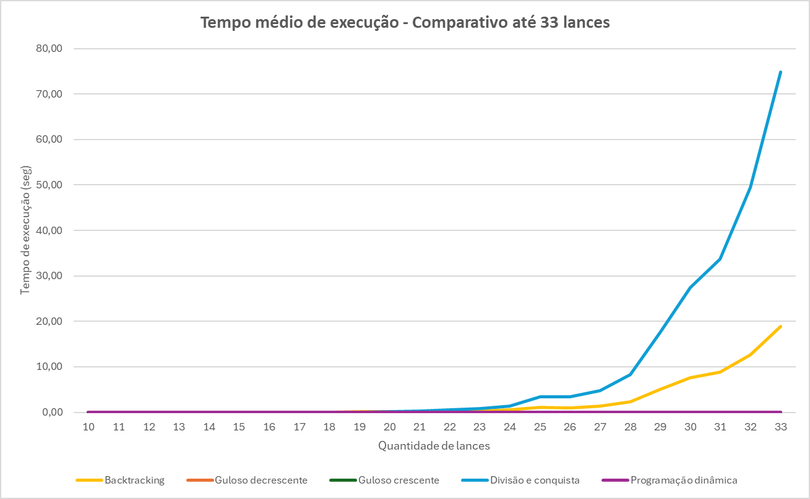
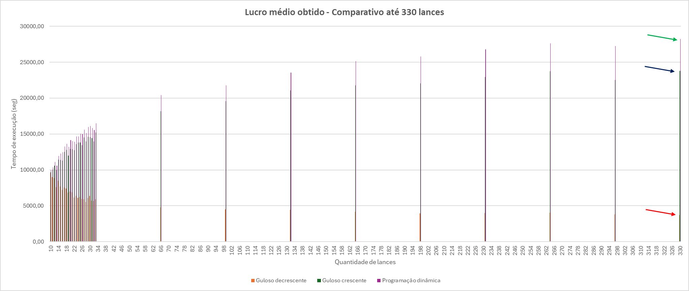

# Análise de desempenho de algoritmos

**Data de entrega:** 24 de junho de 2024

**Grupo:** Breno Rosa Almeida, Guilherme Lage da Costa, Marcos Paulo Freitas da Silva e Vinícius Dias

**Professor:** João Caram Santos de Oliveira

## Índice de conteúdos

1. [Sobre o problema](#sobre-o-problema)
2. [Introdução e objetivo do estudo](#introdução-e-objetivo-do-estudo)
3. [Algoritmo _backtracking_](#algoritmo-_backtracking_)
    1. [Dados de execução](#dados-de-execução)
    2. [Sobre o algoritmo](#sobre-o-algoritmo)
    3. [Algoritmo implementado](#algoritmo-implementado)
    4. [Massa de testes utilizada](#massa-de-testes-utilizada)
    5. [Resultados obtidos](#resultados-obtidos)
4. [Algoritmo guloso](#algoritmo-guloso) -> PENDENTE
5. [Divisão e conquista](#algoritmo-de-divisão-e-conquista) -> PENDENTE
6. [Algoritmo por programação dinâmica](#algoritmo-por-programação-dinâmica)
    1. [Dados de execução](#dados-de-execução-1)
    2. [Sobre o algoritmo](#sobre-o-algoritmo-1)
    3. [Algoritmo implementado](#algoritmo-implementado-1)
    4. [Massa de testes utilizada](#massa-de-testes-utilizada-1)
    5. [Resultados obtidos](#resultados-obtidos-1)
7. [Comparação dos resultados obtidos pelos algoritmos](#comparação-dos-resultados-obtidos-pelos-algoritmos)
    1. [Tempo de execução](#tempo-de-execução)
    2. [Lucro encontrado](#lucro-encontrado)
    3. [Conjuntos solicitados pelo prof. Caram](#conjuntos-solicitados-pelo-prof-caram)
    4. [Comentários finais sobre os resultados encontrados](#comentários-finais-sobre-os-resultados-encontrados)

## Sobre o problema

Uma empresa produtora de energia possui uma quantidade X de energia, medida em megawatts, para vender. Seu objetivo
é vender sua energia produzida, obtendo o maior valor possível no conjunto de suas vendas. As vendas serão realizadas
por leilão: cada empresa interessada E dará um lance por um lote de K megawatts, oferecendo um valor V por este lote. As
interessadas só comprarão um lote do tamanho exato da oferta.

## Introdução e objetivo do estudo

Este trabalho visa analisar e comparar a resolução de um mesmo problema a partir de algoritmos distintos, comparando o
seu desempenho, ganhos e perdas. Para fins de comparação, foram implementados os seguintes algoritmos:

- [Algoritmo _backtracking_](#algoritmo-_backtracking_);
- [Algoritmo guloso](#algoritmo-guloso);
- [Algoritmo de divisão e conquista](#algoritmo-de-divisão-e-conquista);
- [Algoritmo por programação dinâmica](#algoritmo-por-programação-dinâmica).

Nos tópicos a seguir, serão apresentados os dados de execução de cada um desses algoritmos, bem como os resultados
obtidos. Mais adiante, esses dados serão compilados e comparados, concluindo sobre o desempenho de cada um deles.

## Algoritmo _backtracking_

### Dados de execução

- **Responsável**: Guilherme Lage da Costa
- **Matrícula**: 792939
- **JDK**: Java 17
- **Processador**: AMD Ryzen 5 3600, 4.2 Ghz, 6 cores e 12 threads, 32mb de cache
- **RAM**: 16GB, 3000Ghz
- **Sistema Operacional**: Windows 11
- **IDE**: IntelliJ Ultimate

### Sobre o algoritmo

O ***backtracking*** é uma técnica de projetos de algoritmos também conhecida como *retrocesso* ou *tentativa e erro*.
Esse algoritmo é um refinamento da busca por força bruta, na qual algumas soluções podem ser descartadas sem que ao
menos sejam examinadas. Neste algoritmo, são testadas, metodicamente, várias sequências de decisões até encontrar uma
que seja aceitável, ou as descarta até encontrar a melhor solução possível.

De modo geral, esse algoritmo segue inicialmente o padrão de
uma [busca em profundidade](https://www.ime.usp.br/~pf/algoritmos_para_grafos/aulas/dfs.html), ou seja, uma árvore é
percorrida sistematicamente. Quando essa busca falha, ou é encontrado uma folha da árvore (nós sem filhos), entra em
funcionamento o mecanismo que dá nome ao algoritmo de ***backtracking***, fazendo com que o algoritmo retorne pelo mesmo
caminho já percorrido, de modo a buscar soluções alternativas que atendam aos critérios pré-definidos.

### Algoritmo implementado

```java
    public void executar(MelhorResultado melhorResultado, List<Lance> todosLances, List<Lance> lancesSelecionados, int indice, int lucroAtual) {

    int qtdeSelecionada = lancesSelecionados.stream()
            .mapToInt(Lance::quantidade)
            .sum();

    if (lucroAtual > melhorResultado.getLucroMaximizado()) {
        melhorResultado.setLucroMaximizado(lucroAtual);
        melhorResultado.setLancesSelecionados(new ArrayList<>(lancesSelecionados));
    }
    if (indice >= todosLances.size() || qtdeSelecionada >= melhorResultado.getProdutora().quantidadeDisponivel()) {
        return;
    }
    int menorValor = MAX_VALUE;

    for (int i = indice; i < todosLances.size(); i++) {
        menorValor = min(menorValor, todosLances.get(i).quantidade());
    }
    if (qtdeSelecionada + menorValor > melhorResultado.getProdutora().quantidadeDisponivel()) {
        return;
    }
    for (int i = indice; i < todosLances.size(); i++) {
        Lance lance = todosLances.get(i);

        if (qtdeSelecionada + lance.quantidade() < melhorResultado.getProdutora().quantidadeDisponivel()) {
            lancesSelecionados.add(lance);
            executar(melhorResultado, todosLances, lancesSelecionados, i + UM, lucroAtual + lance.valor());
            lancesSelecionados.remove(lancesSelecionados.size() - UM);
        }
    }
}
```

No algoritmo implementado, a função responsável por executar o método de ***backtracking*** recebe cinco parâmetros,
sendo eles:

- `melhorResultado`: `MelhorResultado`
- `todosLances`: `List<Lance>`
- `lancesSelecionados`: `List<Lance>`
- `indice`: `int`
- `lucroAtual`: `int`

O parâmetro `melhorResultado` contém informações sobre a empresa produtora e compradoras, um contador de tempo de
execução, a lista dos lances selecionados, o lucro maximizado e a quantidade disponibilizada para venda pela empresa
produtora. O parâmetro `todosLances` relaciona todos os lances feitos por todas as empresas compradoras,
enquanto `lancesSelecionados` armazena todos os lances selecionados que compõem a combinação em análise. O
parâmetro `indice` indica qual o índice da lista de lances `todosLances` que será analisado, de modo a verificar se ele
pode ser inserido na combinação atual.

O algoritmo se inicia quantificando a quantidade total dos lances atualmente selecionados (em megawatts) e armazena esse
valor na variável `qtdeSelecionada`.

```java
int qtdeSelecionada = lancesSelecionados.stream()
        .mapToInt(Lance::quantidade)
        .sum();
```

Se o lucro atual (`lucroAtual`) for maior do que o valor do maior lucro registrado, armazenado no
atributo `lucroMaximizado` do `melhorResultado`, o algoritmo atualiza o lucro maximizado e a lista de lances
selecionados.

```java
if (lucroAtual > melhorResultado.getLucroMaximizado()) {
    melhorResultado.setLucroMaximizado(lucroAtual);
    melhorResultado.setLancesSelecionados(new ArrayList<>(lancesSelecionados));
}
```

O algoritmo verifica se o índice passado como parâmetro é igual ou maior à quantidade total de lances, ou se a
quantidade selecionada é maior ou igual à quantidade disponível para leilão pela produtora. Se qualquer dessas condições
for verdadeira, a execução termina.

```java
if (indice >= todosLances.size() || qtdeSelecionada >= melhorResultado.getProdutora().quantidadeDisponivel()) {
    return;
}
```

Em seguida, o algoritmo calcula o menor valor de lance a partir do índice atual para garantir que há espaço suficiente
para adicionar um novo lance sem exceder a capacidade de venda.

```java
int menorValor = MAX_VALUE;

for (int i = indice; i < todosLances.size(); i++) {
    menorValor = min(menorValor, todosLances.get(i).quantidade());
}
if (qtdeSelecionada + menorValor > melhorResultado.getProdutora().quantidadeDisponivel()) {
    return;
}
```

Para cada lance válido a partir do índice atual, o algoritmo adiciona o lance à lista de lances selecionados e chama
recursivamente a função `executar` com o próximo índice e o lucro atualizado.

```java
for (int i = indice; i < todosLances.size(); i++) {
    Lance lance = todosLances.get(i);

    if (qtdeSelecionada + lance.quantidade() < melhorResultado.getProdutora().quantidadeDisponivel()) {
        lancesSelecionados.add(lance);
        executar(melhorResultado, todosLances, lancesSelecionados, i + UM, lucroAtual + lance.valor());
        lancesSelecionados.remove(lancesSelecionados.size() - UM);
    }
}
```

De modo geral, o algoritmo de backtracking implementado busca encontrar a combinação de lances que maximiza o lucro
total, respeitando a capacidade de venda da empresa produtora. Para melhorar o seu desempenho, foram realizadas podas em
três pontos distintos, (i) quando o índice atual é maior do que o índice final da lista `todosLances` ou a quantidade
selecionar for superior ao
total disponibilizado para leilão pela produtora; (ii) quando o menor valor de lance disponível for maior do que o
espaço
restante para leilão; e (iii) quando a quantidade selecionada mais a quantidade de um próximo lance for maior do que a
disponibilizada, e dessa forma o algoritmo não executa essa iteração. Ele realiza as seguintes etapas:

1. Calcula a quantidade total dos lances selecionados.
2. Atualiza o melhor resultado encontrado, se o lucro atual for maior que o lucro maximizado.
3. Verifica condições de terminação com base no índice e na quantidade selecionada.
4. Calcula o menor valor de lance a partir do índice atual.
5. Itera sobre os lances válidos, adiciona-os à lista de lances selecionados, e chama recursivamente a
   função `executar`.

Ao final da execução, o algoritmo retorna a melhor combinação de lances encontrada, maximizando o lucro total.

### Massa de testes utilizada

A massa de testes utilizada seguiu os seguintes parâmetros:

- **Quantidade *mínima* p/ compradora = 1000** → indica a quantidade mínima que uma determinada compradora poderia
  solicitar em um lote;
- **Quantidade *máxima* p/ compradora = 1500** → indica a quantidade máxima que uma determinada compradora poderia
  solicitar em um lote;
- **Quantidade disponível pela produtora = 8000** → indica a quantidade total (lote de megawatts) que a empresa
  produtora
  possui, ou seja, que disponibiliza para leilão;
- **Quantidade máxima de lances p/ compradora = 1** → indica a quantidade máxima de lances que cada compradora poderia
  fazer;
- **Quantidades de compradoras = [10, ..., 33]** → foram executados 10 testes para cada quantidade de lances,
  iniciado em 10 e incrementado de 1 a 1 até atingir um tamanho em que o problema não foi possível de ser resolvido em
  até 30 segundos pelo algoritmo. Quando isso aconteceu, foram executados os 10 testes com essa massa e em seguida a
  execução foi finalizada. Na implementação realizada, o algoritmo conseguiu executar massas de testes com **10
  ** até **33** lances. Para cada um desses cenários, foram criados novos conjuntos de testes para que a média de tempo
  fosse calculada, por exemplo, para executar 27 lances, foram criados 10 listas com 27 lances diferentes e em seguida
  calculado o tempo médio entre cada uma dessas execuções. Além desses conjuntos de compradoras e lances, gerados
  aleatoriamente, foram executados dois conjuntos de testes específicos encaminhados pelo prof. Caram, com 25 lances
  cada um.

Os resultados gerados após cada execução do algoritmo foram armazenados automaticamente em dois
arquivos: `exec-log.xls` e `hist-log.xls`. O primeiro log guarda dados gerais da execução como o tempo despendido,
algoritmo utilizado, recursos computacionais disponíveis, dentre outros, enquanto o segundo log guarda os dados sobre os
lances que foram feitos e os que foram escolhidos para combinar o melhor resultado.


<div style="text-align: center;">

*[Exemplo de arquivo de log `exec-log.xls`]*

</div>


<div style="text-align: center;">

*[Exemplo de arquivo de log `hist-log.xls`]*

</div>

O arquivo de análises que compila as execuções realizadas pode ser verificado no
arquivo [analise backtracking](../../analises/analise-backtracking.xlsx).

### Resultados obtidos

Conforme descrito acima, os cenários de testes variaram de 10 a 33 lances, para cada um desses cenários, foram
executados 10 iterações com conjuntos distintos de lances, gerados em tempo de execução, de modo que foram executadas *
*240** execuções ao total (ou seja, (33 - 10) * 10 + 10). Na tabela a seguir, estão relacionados cada um dos cenários de
testes (linhas), e o tempo médio despendido em cada uma das suas iterações (colunas). Os casos em que o tempo de
execução foi inferior a 1 segundo estão indicados com o símbolo "-", ou seja, o tempo de execução não é significativo.

| Quantidade lances | 1     | 2     | 3     | 4     | 5     | 6     | 7     | 8     | 9     | 10    | Tempo médio (seg) |
|-------------------|-------|-------|-------|-------|-------|-------|-------|-------|-------|-------|-------------------|
| 10                | -     | -     | -     | -     | -     | -     | -     | -     | -     | -     | -                 |
| 11                | -     | -     | -     | -     | -     | -     | -     | -     | -     | -     | -                 |
| 12                | -     | -     | -     | -     | -     | -     | -     | -     | -     | -     | -                 |
| 13                | -     | -     | -     | -     | -     | -     | -     | -     | -     | -     | -                 |
| 14                | -     | -     | -     | -     | -     | -     | -     | -     | -     | -     | -                 |
| 15                | -     | -     | -     | -     | -     | -     | -     | -     | -     | -     | -                 |
| 16                | -     | -     | -     | -     | -     | -     | -     | -     | -     | -     | -                 |
| 17                | -     | -     | -     | -     | -     | -     | -     | -     | -     | -     | -                 |
| 18                | -     | -     | -     | -     | -     | -     | -     | -     | -     | -     | -                 |
| 19                | -     | 1,00  | -     | -     | -     | -     | -     | -     | -     | -     | 0,10              |
| 20                | -     | -     | -     | -     | -     | -     | -     | -     | 1,00  | -     | 0,10              |
| 21                | -     | -     | -     | -     | -     | -     | -     | -     | 1,00  | -     | 0,10              |
| 22                | -     | -     | -     | -     | 1,00  | -     | -     | -     | -     | -     | 0,10              |
| 23                | 1,00  | -     | -     | 1,00  | -     | -     | -     | 1,00  | -     | -     | 0,30              |
| 24                | 1,00  | -     | -     | 1,00  | -     | 1,00  | -     | 1,00  | -     | 1,00  | 0,50              |
| 25                | -     | 1,00  | -     | -     | 1,00  | 1,00  | 1,00  | 1,00  | 1,00  | -     | 0,60              |
| 26                | 1,00  | 1,00  | 1,00  | 1,00  | 1,00  | 1,00  | 2,00  | -     | 1,00  | 1,00  | 1,00              |
| 27                | 3,00  | 1,00  | 2,00  | 1,00  | 1,00  | 1,00  | 2,00  | 1,00  | -     | 2,00  | 1,40              |
| 28                | 4,00  | 3,00  | 2,00  | 1,00  | 1,00  | 2,00  | 2,00  | 3,00  | 2,00  | 3,00  | 2,30              |
| 29                | 6,00  | 4,00  | 7,00  | 4,00  | 6,00  | 4,00  | 1,00  | 12,00 | 2,00  | 4,00  | 5,00              |
| 30                | 15,00 | 9,00  | 2,00  | 7,00  | 11,00 | 3,00  | 4,00  | 16,00 | 5,00  | 4,00  | 7,60              |
| 31                | 12,00 | 6,00  | 10,00 | 12,00 | 7,00  | 6,00  | 10,00 | 12,00 | 7,00  | 6,00  | 8,80              |
| 32                | 19,00 | 12,00 | 18,00 | 8,00  | 11,00 | 26,00 | 15,00 | 5,00  | 7,00  | 6,00  | 12,70             |
| 33                | 27,00 | 11,00 | 12,00 | 11,00 | 6,00  | 14,00 | 34,00 | 42,00 | 11,00 | 21,00 | 18,90             |

<div style="text-align: center;">

*[Tabela de tempos médios de execução - Backtracking]*

</div>

Os valores de lucro máximo obtido em cada um dos cenários de testes, e respectivas iterações, são apresentados na tabela
a seguir.

| Quantidade lances | 1      | 2      | 3      | 4      | 5      | 6      | 7      | 8      | 9      | 10     | Melhor lucro médio |
|-------------------|--------|--------|--------|--------|--------|--------|--------|--------|--------|--------|--------------------|
| 10                | 11.373 | 8.394  | 9.690  | 9.040  | 10.005 | 8.368  | 10.421 | 10.152 | 10.625 | 11.697 | 9.977              |
| 11                | 11.045 | 9.075  | 12.153 | 10.521 | 8.854  | 9.458  | 11.361 | 10.629 | 10.105 | 10.587 | 10.379             |
| 12                | 11.395 | 12.706 | 9.367  | 10.763 | 11.212 | 9.854  | 12.350 | 11.432 | 9.855  | 11.932 | 11.087             |
| 13                | 11.059 | 9.279  | 9.575  | 11.873 | 9.421  | 9.821  | 11.747 | 12.300 | 10.670 | 10.045 | 10.579             |
| 14                | 9.274  | 14.021 | 10.814 | 14.062 | 11.814 | 11.063 | 11.309 | 13.356 | 12.220 | 11.493 | 11.943             |
| 15                | 13.535 | 8.200  | 13.383 | 13.756 | 11.483 | 14.188 | 13.611 | 11.064 | 12.690 | 10.956 | 12.287             |
| 16                | 12.160 | 13.591 | 12.249 | 13.478 | 11.905 | 12.510 | 12.011 | 12.417 | 12.924 | 11.580 | 12.483             |
| 17                | 13.424 | 12.573 | 14.009 | 12.169 | 14.769 | 13.004 | 16.050 | 12.196 | 12.516 | 11.776 | 13.249             |
| 18                | 14.208 | 11.297 | 15.407 | 11.440 | 14.408 | 10.804 | 15.238 | 16.301 | 13.775 | 13.227 | 13.611             |
| 19                | 12.453 | 14.352 | 13.737 | 13.724 | 13.662 | 12.215 | 12.236 | 14.697 | 11.784 | 13.330 | 13.219             |
| 20                | 14.831 | 14.268 | 15.035 | 11.828 | 13.712 | 13.552 | 14.871 | 13.827 | 13.986 | 15.356 | 14.127             |
| 21                | 11.951 | 16.218 | 13.216 | 13.626 | 15.327 | 14.926 | 13.176 | 14.002 | 13.501 | 13.957 | 13.990             |
| 22                | 14.270 | 13.253 | 13.694 | 15.215 | 13.076 | 11.853 | 14.362 | 14.574 | 16.733 | 12.014 | 13.904             |
| 23                | 14.160 | 14.795 | 15.002 | 13.760 | 13.577 | 16.308 | 14.030 | 14.619 | 15.402 | 14.902 | 14.656             |
| 24                | 14.003 | 13.505 | 14.812 | 15.435 | 14.425 | 15.916 | 15.243 | 14.105 | 15.037 | 14.274 | 14.676             |
| 25                | 15.837 | 14.717 | 13.223 | 13.437 | 15.213 | 15.876 | 16.253 | 17.029 | 14.090 | 14.621 | 15.030             |
| 26                | 15.217 | 14.726 | 16.423 | 17.017 | 13.700 | 14.073 | 15.667 | 12.722 | 15.887 | 14.232 | 14.966             |
| 27                | 16.934 | 15.958 | 17.389 | 14.517 | 14.770 | 14.705 | 16.279 | 15.783 | 13.216 | 16.202 | 15.575             |
| 28                | 16.909 | 15.472 | 15.263 | 14.260 | 13.573 | 14.049 | 13.686 | 17.431 | 15.361 | 15.299 | 15.130             |
| 29                | 15.956 | 16.563 | 16.741 | 17.101 | 16.104 | 14.728 | 14.132 | 17.076 | 15.299 | 15.806 | 15.951             |
| 30                | 17.738 | 17.273 | 14.179 | 16.732 | 16.281 | 14.321 | 16.194 | 18.770 | 14.250 | 15.564 | 16.130             |
| 31                | 16.662 | 14.927 | 16.779 | 14.237 | 15.641 | 14.458 | 17.013 | 18.222 | 14.349 | 16.191 | 15.848             |
| 32                | 17.290 | 15.307 | 17.305 | 15.826 | 13.945 | 17.748 | 14.959 | 14.481 | 14.309 | 14.393 | 15.556             |
| 33                | 17.028 | 16.308 | 15.647 | 14.528 | 16.205 | 17.425 | 17.212 | 18.868 | 15.911 | 15.793 | 16.493             |

<div style="text-align: center;">

*[Tabela de maior lucro obtido - Backtracking]*

</div>

Os dados indicados na tabela de tempos médios acima são consolidados no gráfico abaixo, que apresenta a evolução do
tempo médio despendido em cada cenário de teste.


<div style="text-align: center;">

*[Gráfico dos tempos médios obtidos com o algoritmo de backtracking]*

</div>

Além dos cenários apresentados, foram executados dois conjuntos adicionais fornecidos pelo prof. Caram, conjunto um e
dois. A relação das informações obtidas com a execução desses conjuntos são elencadas na tabela abaixo.

| Conjunto | Quantidade lances | Lances selecionados | Lucro máximo | Tempo execução (seg) |
|----------|-------------------|---------------------|--------------|----------------------|
| Um       | 25                | 19                  | R$ 26.725,00 | 4                    |
| Dois     | 25                | 21                  | R$ 40.348,00 | 3                    |

<div style="text-align: center;">

*[Tabela de resultados para os conjuntos do prof. Caram - Backtracking]*

</div>

Conforme observado no gráfico apresentado, até a execução com 26 lances, o algoritmo de backtracking conseguia encontrar
o melhor lucro do problema em menos de 1 segundo. A partir desse ponto, os tempos de execução passaram a ser maiores que
1 segundo e começaram a crescer exponencialmente. Com apenas 2 lances adicionais (28 lances), o tempo de
execução foi de 2,3 segundos, um aumento de 130%. Quando o algoritmo executou o cenário com 33 lances, foi
atingido o limite de 30 segundos, fazendo com que esse fosse o último cenário analisado. Neste caso, o tempo médio de
execução foi de 18,9 segundos, ou seja, 722% superior ao cenário com 28 lances.

Os resultados obtidos indicam que, em cenários com baixa quantidade de dados, o backtracking pode se
mostrar uma opção viável, uma vez que o tempo de execução não será significativo. No entanto, à medida que a quantidade
de dados começar a crescer muito, ou uma poda pouco efetiva é utilizada (de modo que o algoritmo execute muitas
operações recursivamente, sem conseguir "podar" muitos cenários), o tempo de execução deste algoritmo pode crescer
significativamente, deixando de ser uma opção interessante para resolver o problema.

Por se tratar de um refinamento do algoritmo de força bruta, em que algumas das combinações possíveis podem ser
descartadas por meio do critério de poda, é de suma importância que esse critério seja bem definido para a execução
satisfatória do algoritmo, uma vez que a quantidade de combinações possíveis, dado um conjunto "n", é da ordem de
2^n - 1, ou seja, para o caso de 33 lances, existem 2^33 - 1 combinações possíveis. Conforme apresentado anteriormente,
foram aplicados três critérios distintos de poda, de modo que o algoritmo não executasse combinações desnecessárias, e,
simultaneamente, conseguisse encontrar o maior lucro possível em um tempo razoável.

## Algoritmo guloso

[A SER DESENVOLVIDO]

## Algoritmo de divisão e conquista

[A SER DESENVOLVIDO]

## Algoritmo por programação dinâmica

### Dados de execução

- **Responsável**: Marcos Paulo Freitas Da Silva
- **Matrícula**: 746639
- **JDK**: Java 17
- **Processador**: Intel Core i5 8265U, 4.2 Ghz, 4 cores e 8 threads, 6mb de cache
- **RAM**: 12GB, 2400Ghz
- **Sistema Operacional**: Windows 11
- **IDE**: IntelliJ Ultimate

### Sobre o algoritmo

A classe `ProgramacaoDinamica` implementa o algoritmo de Programação Dinâmica, uma técnica de otimização que resolve
problemas complexos dividindo-os em subproblemas menores e resolvendo cada subproblema apenas uma vez, armazenando seus
resultados para evitar cálculos repetidos. Este método é eficiente para problemas de otimização onde a solução é
composta de sub-soluções ótimas.

### Algoritmo implementado

```java

@Override
public void executar(
        @NonNull MelhorResultado melhorResultado, @NotNull List<Lance> todosLances, @NonNull List<Lance> lancesSelecionados, int indice, int lucroAtual) {

    int quantidadeDisponivel = melhorResultado.getProdutora().quantidadeDisponivel();
    int n = todosLances.size();
    int capacidade = 8000;

    int[] dp = new int[capacidade + 1];
    int[] selecionados = new int[capacidade + 1];

    for (int i = 0; i < n; i++) {
        Lance lance = todosLances.get(i);
        int quantidade = lance.quantidade();
        int valor = lance.valor();

        for (int j = capacidade; j >= quantidade; j--) {
            if (dp[j - quantidade] + valor > dp[j]) {
                dp[j] = dp[j - quantidade] + valor;
                selecionados[j] = i;
            }
        }
    }

    int maxLucro = 0;
    int melhorCapacidade = 0;

    for (int i = 0; i <= capacidade; i++) {
        if (dp[i] > maxLucro) {
            maxLucro = dp[i];
            melhorCapacidade = i;
        }
    }

    List<Lance> melhoresLances = new ArrayList<>();
    int capacidadeAtual = melhorCapacidade;

    while (capacidadeAtual > 0 && selecionados[capacidadeAtual] != 0) {
        Lance lance = todosLances.get(selecionados[capacidadeAtual]);
        melhoresLances.add(lance);
        capacidadeAtual -= lance.quantidade();
    }

    melhorResultado.setLucroMaximizado(maxLucro);
    melhorResultado.setLancesSelecionados(melhoresLances);
}
```

No algoritmo implementado, a função responsável por executar o método de ***Programção Dinamica*** recebe cinco
parâmetros, sendo eles:

- melhorResultado: `MelhorResultado`;
- todosLances: `List<Lance>`;
- lancesSelecionados: `List<Lance>`;
- indice: `int`;
- lucroAtual: `int`.

`quantidadeDisponivel` armazena a capacidade total de venda.
`n` representa o número total de lances.
`capacidade` define a capacidade máxima (neste caso, 8000).
`dp` é um array para armazenar os lucros máximos possíveis para cada capacidade.
`selecionados` é um array para rastrear os lances que foram selecionados para formar o lucro máximo.

**Construção da Tabela de Programação Dinâmica:**

Para cada lance, se atualiza o array dp de trás para frente, verificando se adicionar o lance atual aumenta o lucro.

**Determinação do Lucro Máximo:**

O algoritmo itera sobre o array dp para encontrar o lucro máximo possível (`maxLucro`) e a capacidade
correspondente (`melhorCapacidade`).

**Rastreamento dos Lances Selecionados:**

A partir da capacidade que gerou o lucro máximo, o algoritmo rastreia os lances que foram selecionados, utilizando o
array `selecionados`.

**Atualização do Melhor Resultado:**

O lucro máximo e a lista de lances selecionados são armazenados no objeto `melhorResultado`.

O algoritmo de programação dinâmica implementado busca encontrar a combinação de lances que maximiza o lucro total,
respeitando a capacidade de venda da empresa produtora. O algoritmo realiza as seguintes etapas:

- Inicializa variáveis e arrays de controle;
- Constrói uma tabela de programação dinâmica para determinar os lucros máximos possíveis para cada capacidade;
- Identifica o lucro máximo e a capacidade correspondente;
- Rastreia os lances que compõem o lucro máximo;
- Atualiza o objeto melhorResultado com o lucro máximo e a lista de lances selecionados;
- Ao final da execução, o algoritmo retorna a melhor combinação de lances encontrada, maximizando o lucro total.

### Massa de testes utilizada

Aqui utilizaremos a mesma massa de testes presente no algoritmo guloso.

### Resultados obtidos

Conforme descrito acima, os cenários de testes variaram de 10 a 35 lances, para cada um desses cenários, foram
executados 10 iterações com conjuntos distintos de lances, gerados em tempo de execução, de modo que foram executadas *
*210** execuções ao total (ou seja, (31 - 10) * 10). Nos primeiros testes realizados com o conjunto de lances gerados
para o backtracking, o tempo de carregamento dos lances foi de 0,00 segundos, ao passo que o valor do melhor resultado
continua o mesmo encontrado no backtracking. A tabela a seguir apresenta os resultados obtidos com a execução do algoritmo de
programação dinâmica.

| Quantidade lances | 1     | 2     | 3     | 4   | 5     | 6     | 7     | 8     | 9     | 10    | Melhor lucro médio |
|-------------------|-------|-------|-------|-----|-------|-------|-------|-------|-------|-------|--------------------|
| 10                | 504   | 393   | 408   | 580 | 248   | 341   | 372   | 449   | 531   | 467   | 429                |
| 11                | 361   | 388   | 548   | 613 | 561   | 627   | 424   | 648   | 597   | 442   | 521                |
| 12                | 574   | 459   | 618   | 465 | 511   | 368   | 334   | 376   | 650   | 651   | 501                |
| 13                | 514   | 653   | 428   | 459 | 672   | 602   | 610   | 537   | 555   | 626   | 566                |
| 14                | 573   | 687   | 822   | 641 | 454   | 555   | 673   | 420   | 551   | 528   | 590                |
| 15                | 765   | 536   | 499   | 654 | 578   | 465   | 571   | 628   | 577   | 563   | 584                |
| 16                | 697   | 777   | 573   | 614 | 569   | 671   | 618   | 696   | 794   | 659   | 667                |
| 17                | 792   | 813   | 658   | 646 | 812   | 501   | 769   | 755   | 625   | 795   | 717                |
| 18                | 568   | 607   | 827   | 511 | 589   | 810   | 724   | 451   | 714   | 522   | 632                |
| 19                | 750   | 561   | 829   | 595 | 789   | 544   | 645   | 756   | 864   | 680   | 701                |
| 20                | 612   | 556   | 804   | 707 | 646   | 830   | 1.005 | 618   | 690   | 755   | 722                |
| 21                | 663   | 660   | 659   | 871 | 473   | 661   | 734   | 956   | 651   | 752   | 708                |
| 22                | 599   | 860   | 534   | 817 | 802   | 772   | 769   | 1.097 | 832   | 763   | 785                |
| 23                | 549   | 953   | 968   | 813 | 737   | 696   | 878   | 789   | 833   | 1.039 | 826                |
| 24                | 886   | 855   | 625   | 999 | 663   | 657   | 633   | 877   | 955   | 886   | 804                |
| 25                | 773   | 1.078 | 746   | 701 | 902   | 709   | 1.137 | 484   | 677   | 882   | 809                |
| 26                | 893   | 768   | 984   | 943 | 867   | 720   | 923   | 815   | 776   | 897   | 859                |
| 27                | 950   | 1.133 | 693   | 650 | 885   | 1.036 | 718   | 853   | 840   | 806   | 856                |
| 28                | 953   | 984   | 1.041 | 904 | 984   | 990   | 984   | 699   | 765   | 990   | 929                |
| 29                | 803   | 1.003 | 916   | 800 | 1.112 | 852   | 972   | 1.067 | 1.049 | 821   | 940                |
| 30                | 775   | 929   | 1.103 | 853 | 1.007 | 754   | 925   | 745   | 828   | 1.003 | 892                |
| 31                | 1.053 | 1.079 | 895   | 975 | 751   | 943   | 1.091 | 876   | 697   | 1.004 | 936                |
| 30                | 775   | 929   | 1.103 | 853 | 1.007 | 754   | 925   | 745   | 828   | 1.003 | 892                |
| 31                | 1.053 | 1.079 | 895   | 975 | 751   | 943   | 1.091 | 876   | 697   | 1.004 | 936                |

## Comparação dos resultados obtidos pelos algoritmos

A seguir serão apresentados comparativos entre os quatro algoritmos implementos sob óticas distintas, como resultado
obtido, tempo de execução, dentre outros.

### Tempo de execução

A análise do tempo será feita em duas etapas, primeiro comparando o trecho comum de execução entre todos os algoritmos,
que vai dos casos de testes com 10 a 33 lances, e em seguida comparando os algoritmos que foram até 330 lances (Guloso e
Programação dinãmica). Para a primeira etapa (10 a 33 lances), o algoritmo de Divisão e Conquista foi a implementação
que apresentou o pior desempenho, com tempo médio por execução de 9,42 segundos, seguido pela implementação do
Backtracking, com tempo médio por execução de 2,5 segundos. Para esse cenário, as implementações do algoritmo Guloso e
Programação dinâmica apresentaram tempo de execução inferior a 1 segundo, estando indicado pelo símbolo "-" na tabela
abaixo.

| Qtde lances | Backtracking | Guloso decrescente | Guloso crescente | Divisão e conquista | Programação dinâmica |
|-------------|--------------|--------------------|------------------|---------------------|----------------------|
| 10          | -            | -                  | -                | -                   | -                    |
| 11          | -            | -                  | -                | -                   | -                    |
| 12          | -            | -                  | -                | -                   | -                    |
| 13          | -            | -                  | -                | -                   | -                    |
| 14          | -            | -                  | -                | -                   | -                    |
| 15          | -            | -                  | -                | -                   | -                    |
| 16          | -            | -                  | -                | -                   | -                    |
| 17          | -            | -                  | -                | -                   | -                    |
| 18          | -            | -                  | -                | -                   | -                    |
| 19          | 0,10         | -                  | -                | -                   | -                    |
| 20          | 0,10         | -                  | -                | 0,10                | -                    |
| 21          | 0,10         | -                  | -                | 0,30                | -                    |
| 22          | 0,10         | -                  | -                | 0,50                | -                    |
| 23          | 0,30         | -                  | -                | 0,80                | -                    |
| 24          | 0,50         | -                  | -                | 1,40                | -                    |
| 25          | 1,08         | -                  | -                | 3,42                | -                    |
| 26          | 1,00         | -                  | -                | 3,40                | -                    |
| 27          | 1,40         | -                  | -                | 4,80                | -                    |
| 28          | 2,30         | -                  | -                | 8,30                | -                    |
| 29          | 5,00         | -                  | -                | 17,50               | -                    |
| 30          | 7,60         | -                  | -                | 27,50               | -                    |
| 31          | 8,80         | -                  | -                | 33,70               | -                    |
| 32          | 12,70        | -                  | -                | 49,40               | -                    |
| 33          | 18,90        | -                  | -                | 74,90               | -                    |
| Tempo médio | 2,50         | -                  | -                | 9,42                | -                    |

<div style="text-align: center;">

*[Tabela de comparação de desempenho de 10 a 33 lances]*

</div>



<div style="text-align: center;">

*[Gráfico de comparação de desempenho de 10 a 33 lances]*

</div>

Para a segunda etapa, comparamos os algoritmos que executaram até o cenário com 330 lances (Guloso e
Programação dinãmica). Para ambas implementações o tempo de execução foi inferior a 1 segundo, conforme pode ser
verificado no gráfico a seguir.


<div style="text-align: center;">

*[Gráfico de comparação de desempenho de 10 a 330 lances]*

</div>

### Lucro encontrado

De maneira análoga à análise do tópico acima, a análise do lucro encontrado também será dividida em duas etapas,
primeiro comparando o trecho comum de execução entre todos os algoritmos, que vai dos casos de testes com 10 a 33
lances, e em seguida comparando os algoritmos que foram até 330 lances (Guloso e Programação dinãmica). Para a primeira
etapa, conseguimos verificar que o lucro encontrado pelos algoritmos de Backtracking, Divisão e conquista e Programação
se manteve o mesmo durante todos os casos de teste, o que se é esperado para estes algoritmos. A implementação do
algoritmo Guloso que utilizou como metodologia a ordenação dos lances por ordem crescente apresentou resultado
satisfatório, haja visto que na média apresentou um lucro máximo 7% abaixo do resultado ótimo (lucro máximo possível) e
possui um tempo de execução muito baixo. A implementação do algoritmo Guloso que ordenou os lances por ordem decrescente
não apresentou resultado satisfatório, com lucro médio 50% inferior ao resultado ótimo esperado.

| Qtde lances    | Backtracking | Guloso decrescente | Guloso crescente | Divisão e conquista | Programação dinâmica |
|----------------|--------------|--------------------|------------------|---------------------|----------------------|
| 10             | 9.976,50     | 9.614,50           | 9.704,70         | 9.976,50            | 9.976,50             |
| 11             | 10.378,80    | 8.977,90           | 10.011,60        | 10.378,80           | 10.378,80            |
| 12             | 11.086,60    | 8.877,10           | 10.609,20        | 11.086,60           | 11.086,60            |
| 13             | 10.579,00    | 7.612,30           | 9.981,00         | 10.579,00           | 10.579,00            |
| 14             | 11.942,60    | 8.488,10           | 11.448,50        | 11.943,30           | 11.943,30            |
| 15             | 12.286,60    | 7.688,50           | 11.405,90        | 12.286,60           | 12.286,60            |
| 16             | 12.482,50    | 7.240,80           | 11.278,40        | 12.482,50           | 12.482,50            |
| 17             | 13.248,60    | 7.553,20           | 12.493,00        | 13.248,60           | 13.248,60            |
| 18             | 13.610,50    | 7.416,50           | 12.802,30        | 13.610,50           | 13.610,50            |
| 19             | 13.219,00    | 6.850,30           | 12.006,60        | 13.219,00           | 13.219,00            |
| 20             | 14.126,60    | 6.988,60           | 12.928,80        | 14.126,60           | 14.126,60            |
| 21             | 13.990,00    | 6.908,70           | 12.886,20        | 13.990,00           | 13.990,00            |
| 22             | 13.904,40    | 6.159,30           | 12.760,80        | 13.904,40           | 13.904,40            |
| 23             | 14.655,50    | 6.360,20           | 13.578,40        | 14.655,50           | 14.655,50            |
| 24             | 14.675,50    | 6.081,20           | 13.841,30        | 14.675,50           | 14.675,50            |
| 25             | 15.029,60    | 6.235,50           | 13.836,20        | 15.029,60           | 15.029,60            |
| 26             | 14.966,40    | 5.937,80           | 13.428,70        | 14.980,10           | 14.980,10            |
| 27             | 15.575,30    | 5.917,50           | 14.507,60        | 15.575,30           | 15.575,30            |
| 28             | 15.130,30    | 5.540,50           | 13.950,20        | 15.130,30           | 15.130,30            |
| 29             | 15.950,60    | 6.108,20           | 14.618,90        | 15.950,60           | 15.950,60            |
| 30             | 16.130,20    | 6.399,30           | 14.582,40        | 16.130,20           | 16.130,20            |
| 31             | 15.847,90    | 5.727,70           | 14.422,40        | 15.847,90           | 15.847,90            |
| 32             | 15.556,30    | 5.678,30           | 13.943,60        | 15.556,30           | 15.556,30            |
| 33             | 16.492,50    | 5.919,80           | 15.233,80        | 16.492,50           | 16.492,50            |
| Lucro médio    | 13.785,08    | 6.928,41           | 12.760,85        | 13.785,68           | 13.785,68            |
| % lucro máximo | 100%         | 50%                | 93%              | 100%                | 100%                 |

<div style="text-align: center;">

*[Tabela de comparação de valores de 10 a 33 lances]*

</div>


<div style="text-align: center;">

*[Gráfico de comparação de valores de 10 a 33 lances]*

</div>

Comparando os algoritmos que seguiram a execução até 330 lances, podemos observar que o desempenho de ambas as
implementações do algoritmo guloso caíram. Para a implementação por ordem crescente (seta azul no gráfico), o lucro na
última execução
apresentou 84% do lucro máximo obtido pela Programação dinâmica (seta verde no gráfico), enquanto a implementação por
ordem decrescente
apresentou apenas 13% do lucro máximo obtido pela Programação dinâmica (seta vermelha no gráfico).



<div style="text-align: center;">

*[Gráfico de comparação de valores de 10 a 330 lances]*

</div>

### Conjuntos solicitados pelo prof. Caram

Conforma informado anteriormente, foram disponibilizados dois conjuntos adicionais pelo professor para que fossem
realizados testes com eles. Cada um desses conjuntos possuía 25 lances, com combinações diferentes de quantidade e valor
por lance. Para fins de análise, esses conjuntos serão referenciados como conjuntos 1 e 2. Conforme pode ser observado
na tabela a seguir, o lucro máximo obtido pelos algoritmos de Backtracking, Guloso crescente, Divisão e conquista, e
Programação dinâmica para o conjunto 1 foi de R$ 26.725,00. O Guloso decrescente, por sua vez, apresentou lucro final de
R$ 24.219,00.

Os algoritmos de Backtracking e Divisão e conquista apresentaram os maios tempos de execução para esses cenários,
despendendo 4 e 10 segundos para o conjunto 1, e 3 e 10 segundos para o conjunto 2, respectivamente.

| Algoritmo            | Nº Conjunto | Qtde lances | Tempo (seg) | Lances selecionados | Lucro obtido |
|----------------------|-------------|-------------|-------------|---------------------|--------------|
| Backtracking         | 1           | 25          | 4           | 19                  | 26.725,00    |
| Guloso decrescente   | "           | "           | 0           | 19                  | 24.219,00    |
| Guloso crescente     | "           | "           | 0           | 19                  | 26.725,00    |
| Divisão e conquista  | "           | "           | 10          | 19                  | 26.725,00    |
| Programação dinâmica | "           | "           | 0           | 19                  | 26.725,00    |
| Backtracking         | 2           | 25          | 3           | 21                  | 40.348,00    |
| Guloso decrescente   | "           | "           | 0           | 21                  | 36.916,00    |
| Guloso crescente     | "           | "           | 0           | 22                  | 39.408,00    |
| Divisão e conquista  | "           | "           | 10          | 21                  | 40.348,00    |
| Programação dinâmica | "           | "           | 0           | 16                  | 40.348,00    |

<div style="text-align: center;">

*[Tabela de comparação de valores e tempos dos conjuntos 1 e 2]*

</div>

### Comentários finais sobre os resultados encontrados

Com base nos resultados obtidos, foi possível verificar que, de modo geral, em conjuntos pequenos, a escolhe de um
algoritmo mais ou menos eficaz não se mostra muito expressiva, haja vista que os tempos de execução tendem a ser
inferiores a 1 segundo. Nos nossos casos de testes, pode-se dizer que em um conjunto de aproximadamente 20 a 23 dados, o
algoritmo implementado não é muito significante. No entanto, a partir desse ponto, a diferença de desempenho começou a
ser representativa, ao passo que com mais de 33 lances, por exemplo, tínhamos algoritmos gastando mais de 1 minuto para
executar o conjunto, enquanto outros executavam até 330 lances em menos de 1 segundo.
