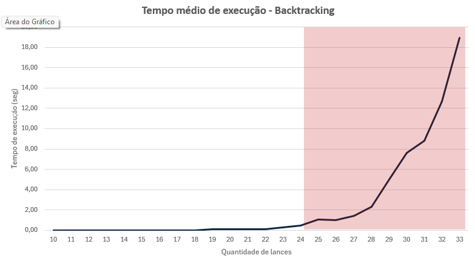

# Análise de desempenho de algoritmos

**Data de entrega:** 24 de junho de 2024

**Grupo:** Breno Rosa Almeida, Guilherme Lage da Costa, Marcos Paulo Freitas da Silva e Vinícius Dias

**Professor:** João Caram Santos de Oliveira

## Índice de conteúdos

1. [Sobre o problema](#sobre-o-problema)
2. [Introdução e objetivo do estudo](#introdução-e-objetivo-do-estudo)
3. [Algoritmo _backtracking_](#algoritmo-_backtracking_)
    1. [Dados de execução](#dados-de-execução)
    2. [Sobre o algoritmo](#sobre-o-algoritmo)
    3. [Algoritmo implementado](#algoritmo-implementado)
    4. [Resultados obtidos](#resultados-obtidos)
4. [Algoritmo guloso](#algoritmo-guloso) -> PENDENTE
5. [Divisão e conquista](#algoritmo-de-divisão-e-conquista) -> PENDENTE
6. [Algoritmo por programação dinâmica](#algoritmo-por-programação-dinâmica) -> PENDENTE
7. [Comparação dos resultados obtidos pelos algoritmos](#comparação-dos-resultados-obtidos-pelos-algoritmos)

## Sobre o problema

Uma empresa produtora de energia possui uma quantidade X de energia, medida em megawatts, para vender. Seu objetivo
é vender sua energia produzida, obtendo o maior valor possível no conjunto de suas vendas. As vendas serão realizadas
por leilão: cada empresa interessada E dará um lance por um lote de K megawatts, oferecendo um valor V por este lote. As
interessadas só comprarão um lote do tamanho exato da oferta.

## Introdução e objetivo do estudo

Este trabalho visa analisar e comparar a resolução de um mesmo problema a partir de algoritmos distintos, comparando o
seu desempenho, ganhos e perdas. Para fins de comparação, foram implementados os seguintes algoritmos:

- [Algoritmo _backtracking_](#algoritmo-_backtracking_);
- [Algoritmo guloso](#algoritmo-guloso);
- [Algoritmo de divisão e conquista](#algoritmo-de-divisão-e-conquista);
- [Algoritmo por programação dinâmica](#algoritmo-por-programação-dinâmica).

Nos tópicos a seguir, serão apresentados os dados de execução de cada um desses algoritmos, bem como os resultados
obtidos. Mais adiante, esses dados serão compilados e comparados, concluindo sobre o desempenho de cada um deles.

## Algoritmo _backtracking_

### Dados de execução

- **Responsável**: Guilherme Lage da Costa
- **Matrícula**: 792939
- **JDK**: Java 17
- **Processador**: AMD Ryzen 5 3600, 4.2 Ghz, 6 cores e 12 threads, 32mb de cache
- **RAM**: 16GB, 3000Ghz
- **Sistema Operacional**: Windows 11
- **IDE**: IntelliJ Ultimate

### Sobre o algoritmo

O ***backtracking*** é uma técnica de projetos de algoritmos também conhecida como *retrocesso* ou *tentativa e erro*.
Esse algoritmo é um refinamento da busca por força bruta, na qual algumas soluções podem ser descartadas sem que ao
menos sejam examinadas. Neste algoritmo, são testadas, metodicamente, várias sequências de decisões até encontrar uma
que seja aceitável, ou as descarta até encontrar a melhor solução possível.

De modo geral, esse algoritmo segue inicialmente o padrão de
uma [busca em profundidade](https://www.ime.usp.br/~pf/algoritmos_para_grafos/aulas/dfs.html), ou seja, uma árvore é
percorrida sistematicamente. Quando essa busca falha, ou é encontrado uma folha da árvore (nós sem filhos), entra em
funcionamento o mecanismo que dá nome ao algoritmo de ***backtracking***, fazendo com que o algoritmo retorne pelo mesmo
caminho já percorrido, de modo a buscar soluções alternativas que atendam aos critérios pré-definidos.

### Algoritmo implementado

```java
public void executar(MelhorResultado melhorResultado, List<Lance> todosLances, List<Lance> lancesSelecionados, int indice, int lucroAtual) {

    int qtdeSelecionada = lancesSelecionados.stream()
            .mapToInt(Lance::quantidade)
            .sum();
//        Se a quantidade de lances selecionados somar uma quantidade maior do que a disponível, podar, pois não é um resultado aceitável
    if (qtdeSelecionada > melhorResultado.getProdutora().quantidadeDisponivel())
        return;
//        Se já percorreu todos os lances em uma determinada busca, e a quantidade selecionada não ultrapassa a disponível, verifica se o lucro aumentou
    if (indice == todosLances.size()) {
        if (lucroAtual > melhorResultado.getLucroMaximizado()) {
            melhorResultado.setLucroMaximizado(lucroAtual);
            melhorResultado.setLancesSelecionados(new ArrayList<>(lancesSelecionados));
        }
        return;
    }
//        Se não percorreu ainda todos os lances, segue a busca adicionado o lance do índice atual à lista de lances selecionados
    Lance lanceAnalisado = todosLances.get(indice);

    if (!isNull(lanceAnalisado)) {
        lancesSelecionados.add(lanceAnalisado);
        executar(melhorResultado, todosLances, lancesSelecionados, indice + UM, lucroAtual + lanceAnalisado.valor());
        lancesSelecionados.remove(lancesSelecionados.size() - UM);
    }
    executar(melhorResultado, todosLances, lancesSelecionados, indice + UM, lucroAtual);
}
```

No algoritmo implementado, a função responsável por executar o método de ***backtracking*** recebe cinco parâmetros,
sendo eles:

- melhorResultado: `MelhorResultado`;
- todosLances: `List<Lance>`;
- lancesSelecionados: `List<Lance>`;
- indice: `int`;
- lucroAtual: `int`.

o parâmetro de `melhorResultado` possui informações sobre a empresa produtora e compradoras, um
contador de tempo de execução, lista dos lances selecionados, lucro maximizado e a quantidade disponibilizada para venda
pela empresa produtora. O parâmetro `todosLances` relaciona todos os lances feitos por todas as empresas compradoras,
enquanto `lancesSelecionados` relaciona todos os lances selecionados que compõem o maior lucro
possível, armazenado em `lucroMaximizado`. O parâmetro `indice` indica qual o índice da lista de lances `todosLances`
que será analisado para verificar se cabe no melhor resultado possível, que por sua vez é armazenado no
parâmetro `lucroAtual`.

O algoritmo se inicia quantificando qual é a quantidade total dos lances atualmente selecionados (*linha 4* - em
megawatts) e o armazena na variável `qtdeSelecionada`, essa variável é utilizada para verificar, na *linha 7*, se essa
quantidade é superior à quantidade disponível de venda. Caso a quantidade selecionada seja superior à de venda, essa
solução não é aceitável, sendo desconsiderada no ***return*** da *linha 8*. Essa poda foi aplicada para garantir que o
melhor resultado sempre fosse encontrado, como não existiam muitas variáveis no problema, apenas valor e peso, optou-se
por essa abordagem, pois mesmo que poucas podas fossem feitas, a quantidade de variáveis ainda assim não seria alta,
garantindo um desempenho razoável do algoritmo.

Posteriormente, na condicional da *linha 10*, é verificado se o índice passado como parâmetro é igual à quantidade de
lances total, se essa validação for verdadeira, significa não haver mais lances para avaliar nessa iteração, uma vez
que o índice chegou ao último lance. Em seguida (*linha 11*), é verificado se o `lucroAtual` (soma do valor de todos
os `lancesSelecionados`) é maior que o valor do maior lucro registrado, armazenado no atributo `lucroMaximizado`
do `melhorResultado`, se for maior, atualiza-se o lucro maximizado e a lista de lances selecionados nas *linhas 12 e
13*. Se o lucro atual não for maior do que o lucro maximizado, essa solução é desconsiderada no **return** da *linha
15*.

Na *linha 18* é selecionado um novo lance que será analisado, caso ele não seja `null` (*linha 20*), prossegue para uma
nova sequência de instrução. A validação se o `lanceAnalisado` não é nulo é importante pois, como o algoritmo executa
recursivamente sobre a lista na posição índice + 1, pode-se chegar em um ponto em que o próximo valor é nulo, como é o
caso quando o lance analisado é o último da lista, por exemplo.

Se o lance não for nulo, ele é adicionado á lista de `lancesSelecionados` (*linha 21*) e chama-se a função de *
*backtracking** recursivamente sobre essa nova lista de lances (*linha 22*). Quando a execução chegar ao fim, esse lance
é removido da lista na *linha 23* e, em seguida, chamado uma nova execução do algoritmo na próxima posição do índice,
*linha 25*.

Ao final da execução, o algoritmo retorna a melhor combinação de lances encontrada, buscando maximizar o lucro total.

### Massa de testes utilizada

A massa de testes utilizada seguiu os seguintes parâmetros:

- **Quantidade *mínima* p/ compradora = 10** → indica a quantidade mínima que uma determinada compradora poderia
  solicitar em um lote;
- **Quantidade *máxima* p/ compradora = 100** → indica a quantidade máxima que uma determinada compradora poderia
  solicitar em um lote;
- **Quantidade disponível pela produtora = 200** → indica a quantidade total (lote total) que a empresa produtora
  possui, ou seja, que disponibiliza para leilão;
- **Quantidade máxima de lances p/ compradora = 1** → indica a quantidade máxima de lances que cada compradora poderia
  fazer;
- **Quantidades de compradoras = [10, ..., 31]** → foram executados 10 testes para cada quantidade de lances,
  iniciado em 10 e incrementado de 1 a 1 até atingir um tamanho em que o problema não foi possível de ser resolvido em
  até 30 segundos pelo algoritmo. Quando isso aconteceu, foram executados mais 10 testes com essa massa e em seguida a
  execução foi finalizada. No caso da implementação realizada, o algoritmo conseguiu executar massa de testes com 10 até
  31 lances. Para cade cenário de lances, foram criados novos conjuntos de testes para que a média fosse calculada, de
  modo que para verificar o tempo médio gasto para executar 27 lances, por exemplo, foram criados 10 listas com 27
  lances diferentes.

Os resultados gerados após cada execução do algoritmo foram armazenados automaticamente em dois
arquivos: `exec-log.xls` e `hist-log.xls`. O primeiro log guarda dados gerais da execução como o tempo despendido,
algoritmo utilizado, recursos computacionais disponíveis, dentre outros, enquanto o segundo log guarda os dados sobre os
lances que foram feitos e os que foram escolhidos para combinar o melhor resultado.


<div style="text-align: center;">

*[Exemplo de arquivo de log `exec-log.xls`]*

</div>


<div style="text-align: center;">

*[Exemplo de arquivo de log `hist-log.xls`]*

</div>


O arquivo de análises que compila as execuções realizadas pode ser verificado no
arquivo [analise backtracking](../../analises/analise-backtracking.xlsx).

### Resultados obtidos

Para o algoritmo de `Backtracking`, foram realizados ao total 210 execuções, considerando as 10 iterações para cada
cenário, que se iniciou com 10 lances (1 por compradora) e finalizou com 31. O tempo de execução médio (em segundos)
para cada um desses cenários é exposto na tabela a seguir. Os casos em que o tempo de execuçao foram menor do que 1
segundo estão indicados como "-", ou seja, o tempo de execução para esses casos não foi significante. Além disso, as
colunas da tabela indicam cada uma das 10 execuções realizadas para cada quantidade de lance.

| Quantidade lances | 1     | 2     | 3    | 4     | 5     | 6    | 7     | 8    | 9     | 10    | Tempo médio |
|-------------------|-------|-------|------|-------|-------|------|-------|------|-------|-------|-------------|
| 10                | -     | -     | -    | -     | -     | -    | -     | -    | -     | -     | -           |
| 11                | -     | -     | -    | -     | -     | -    | -     | -    | -     | -     | -           |
| 12                | -     | -     | -    | -     | -     | -    | -     | -    | -     | -     | -           |
| 13                | -     | -     | -    | -     | -     | -    | -     | -    | -     | -     | -           |
| 14                | -     | -     | -    | -     | -     | -    | -     | -    | -     | -     | -           |
| 15                | -     | -     | -    | -     | -     | -    | -     | -    | -     | -     | -           |
| 16                | -     | -     | -    | -     | -     | -    | -     | -    | -     | -     | -           |
| 17                | -     | -     | -    | -     | -     | -    | -     | -    | -     | -     | -           |
| 18                | -     | 1,00  | -    | -     | -     | -    | -     | -    | -     | -     | 0,10        |
| 19                | -     | -     | -    | -     | -     | -    | -     | -    | -     | -     | -           |
| 20                | -     | -     | -    | -     | -     | -    | -     | -    | 1,00  | -     | 0,10        |
| 21                | -     | -     | -    | -     | -     | -    | -     | -    | -     | -     | -           |
| 22                | -     | 1,00  | -    | -     | -     | -    | -     | -    | 1,00  | -     | 0,20        |
| 23                | -     | -     | -    | 1,00  | -     | -    | 1,00  | -    | -     | -     | 0,20        |
| 24                | -     | 1,00  | -    | -     | -     | -    | 1,00  | 1,00 | 1,00  | 1,00  | 0,50        |
| 25                | -     | -     | -    | 1,00  | -     | 1,00 | 1,00  | -    | -     | -     | 0,30        |
| 26                | 1,00  | 1,00  | -    | 2,00  | 1,00  | -    | 1,00  | 2,00 | -     | 2,00  | 1,00        |
| 27                | 1,00  | 6,00  | -    | 2,00  | 1,00  | 4,00 | 1,00  | 2,00 | 1,00  | 1,00  | 1,90        |
| 28                | 5,00  | 3,00  | 4,00 | 1,00  | 6,00  | 3,00 | 2,00  | -    | -     | 2,00  | 2,60        |
| 29                | 1,00  | 12,00 | 1,00 | 3,00  | 5,00  | -    | 2,00  | 4,00 | 13,00 | 3,00  | 4,40        |
| 30                | 3,00  | 2,00  | 9,00 | 4,00  | 11,00 | 2,00 | 6,00  | 1,00 | 3,00  | 14,00 | 5,50        |
| 31                | 62,00 | 10,00 | 1,00 | 10,00 | 1,00  | 9,00 | 10,00 | 8,00 | 2,00  | 4,00  | 11,70       |

<div style="text-align: center;">

*[Tabela de tempos médios de execução - Backtracking]*

</div>

Os dados indicados na tabela acima são representados no gráfico abaixo.




<div style="text-align: center;">

*[Gráfico dos tempos médios obtidos com o algoritmo de backtracking]*

</div>

Conforme pode ser observado no gráfico acima, até a execuçao com 26 lances, o algoritmo de backtracking conseguia
encontrar o melhor lucro do problema com menos de 1 segundo. A partir desse cenário, os tempos de execução
passaram a ser maiores do que 1 segundo e começaram a crescer exponencialmente, ao passo que com apenas 2 execuções a
mais, na execução com 28 lances, o tempo de execução já estava próximo de 3 segundos, um aumento de 260%. Quando o
algoritmo executou o cenário com 31 lances, os tempos médios começaram a ser superior a 30 segundos, fazendo com que
esse fosse o último cenário analisado. No último cenário analisado, com 31 lances, o tempo de execução foi de 11,7
segundos, ou seja, 1170% superior ao cenário com 28 lances que demandou 1 segundo.

O que se percebe pelos resultados obtidos é que em cenários com baixa quantidade de dados a serem analisados, o
_backtracking_ pode se mostrar uma opção viável, haja vista que o tempo de execução não será representativo. No entanto,
a partir do momento que a quantidade de dados começarem a
crescer muito, ou uma poda pouco efetiva seja utilizada, de modo que o algoritmo começe executar muitas operações
recursivamente, sem conseguir "podar" muitos cenários, o tempo de execução deste algoritmo pode crescer muito,
deixando de ser uma opção interessante para resolver o problema.

Por se tratar de um "aperfeiçoamento" do algoritmo de força bruta, em que algumas das combinações possíveis podem ser
descartadas por meio do critério de poda, é de suma importância que esse critério seja bem definido para a execução
satisfatória do algoritmo. Conforme apresentado anteriormente, a técnica de poda adotada neste algoritmo foi sobre a
quantidade somada (em megawatts) pelos lances já escolhidos durante a execução, podando posteriores iterações caso o
valor da quantidade atual, mais o próximo lance, ultrapassassem o total disponível pela empresa Produtora. Essa
abordagem foi adotada de modo que eventuais combinações não fossem descartadas precocemente, e sim apenas quando
realmente não fosse mais possível selecionar nenhum lance adicional, de modo a buscar o maior lucro possível.

## Algoritmo guloso

[A SER DESENVOLVIDO]

## Algoritmo de divisão e conquista

[A SER DESENVOLVIDO]

## Algoritmo por programação dinâmica

[A SER DESENVOLVIDO]

## Comparação dos resultados obtidos pelos algoritmos

[A SER DESENVOLVIDO]
